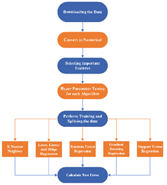

# House Prices Regression Models

## Introduction

Housing and accommodation are fundamental needs globally, but financial constraints pose challenges in acquiring a home.
This project focuses on optimizing house price predictions through various regression techniques, including Random
Forest, KNN, Linear Regression, Lasso Regression, Gradient Boosting Regression, Support Vector Regression, and Ridge
Regression. The objective is to provide accurate insights for prospective buyers and real estate advisors, aiding in
property comparison and informed decision-making. The study considers influential factors like physical conditions,
concept, and location.

## Data and Methodology

The research utilizes datasets from Kaggle, a reputable platform known for accurate and comprehensive data. Algorithms
such as Linear Regression (LR), Ridge Regression (RR), Lasso Regression (LR), Gradient Boosting Regression (GBR), Random
Forest Regression (RFR), Support Vector Regression (SVR), and K Nearest Neighbors (KNN) are employed. Performance
evaluation metrics include scores, Mean Square Error (MSE), and R-Squared. The implementation is carried out in Python,
and the code is available on GitHub at [project repository](https://github.com/pariyaab/House_Prices_Regression_Models).

## Data Flow

The project's data flow and processing intricacies are visualized in Figure 1, encapsulating the essence of the
methodology in predicting house prices with precision.

## Related Works

The project builds upon existing research, drawing inspiration from studies like [1], which conducted a comparative
analysis of regression techniques for house price prediction. Valuable insights from these works guide the selection of
algorithms and evaluation metrics.

## Key Findings

- The study reveals that Gradient Boosting Regression showed the highest accuracy in house price predictions based on
  previous research [1].
- Crucial variables in predicting house prices include square footage, number of bathrooms, and bedrooms, aligning with
  previous studies [5].
- Locational and structural attributes significantly influence house prices, emphasizing factors like hospital access,
  schools, and neighborhood attributes [7].
- The Random Forest algorithm is explored and validated as an effective technique for house price prediction, in line
  with findings by Adetunji et al. [9].

## How to Use

To replicate the study or utilize the predictive models, follow these steps:

1. Clone the repository: `git clone https://github.com/pariyaab/House_Prices_Regression_Models.git`
2. Install the required dependencies: `pip install -r requirements.txt`
3. Execute the Python scripts for specific regression models.

## Conclusion

This project contributes to the understanding of house price prediction by exploring various regression techniques and
considering influential factors. The findings aim to empower individuals in the real estate market to make informed
decisions. Collaborations and contributions to enhance the project are welcome.

Feel free to explore the [project repository](https://github.com/pariyaab/House_Prices_Regression_Models) for detailed
code and documentation.
